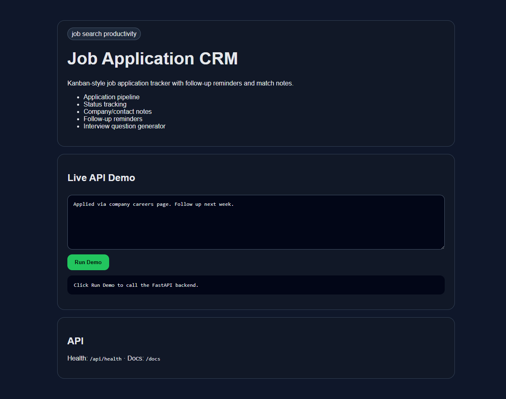

# Job Application CRM

    

Kanban-style job application tracker with an outreach layer: contacts, channels, and an automated follow-up cadence - plus reply-rate stats per channel so you can see which channel actually works.



## Why this project exists

Cold applications convert at 1-2%. Referrals and direct outreach convert at 15-40%. This tracker is built for the second kind of search: log who you contacted, through which channel, when the follow-up is due, and what came back. The kanban board keeps the application pipeline visible; the outreach log makes follow-ups impossible to drop and reply rates impossible to guess at.

## Features

- Application pipeline (kanban by stage: saved / applied / interviewing / offer / rejected)
- Interview question generator
- **Outreach log** - one row per touch: company, role, channel, contact, sent date, status
- **Follow-up cadence** - auto-scheduled: send -> follow up in 4 days -> 5 days after each logged follow-up -> max 2 rounds, then it stops. Moving a row to screen/interview/offer/rejected/dead clears the cadence; replied keeps it running until the conversation actually moves on.
- **Due-now queue** - everything due today, one click to log the follow-up or mark replied
- **Channel dashboard** - reply rate, sent volume, and funnel counts per channel (referral / recruiter / hiring manager / cold apply / LinkedIn DM)

## Tech Stack

- Python 3.11+
- FastAPI
- SQLite (single file, gitignored)
- Vanilla HTML/CSS/JS frontend served by the API
- Pytest API tests (hermetic - temp DB per test)

## Quick Start

```bash
uv sync
uv run uvicorn src.main:app --reload --port 8105
```

Then open: http://localhost:8105

Windows one-click launcher: `run.bat`

## API

Applications (unchanged legacy surface):

- `GET /api/applications` - kanban board
- `POST /api/applications` - add application
- `POST /api/interview-questions` - question generator

Outreach layer:

- `POST /api/outreaches` - log an outreach (auto-computes follow-up date)
- `GET /api/outreaches?channel=&status=&due=true` - list, filtered; due=true = follow-up overdue or due today
- `PATCH /api/outreaches/{id}` - update status / notes / variant, or `{"log_follow_up": true}` to advance the cadence
- `DELETE /api/outreaches/{id}`
- `GET /api/dashboard` - reply rate by channel, funnel counts, due count, sent in last 30 days

Infra:

- `GET /api/health` - health check
- `GET /docs` - interactive FastAPI docs

## Follow-up cadence rules

- `sent` / `replied` statuses schedule follow-ups: +4 days after send, then +5 days after each logged follow-up, capped at 2 rounds
- `screen`, `interview`, `offer`, `rejected`, `dead` clear the automated cadence (a real conversation takes over)
- `draft` rows never schedule

## Verification

```bash
uv run pytest -q
```

## Roadmap

- Add authenticated user accounts
- Add production deployment config
- Replace deterministic helper logic with local Ollama model calls where useful
- Add screenshots and a short demo GIF
